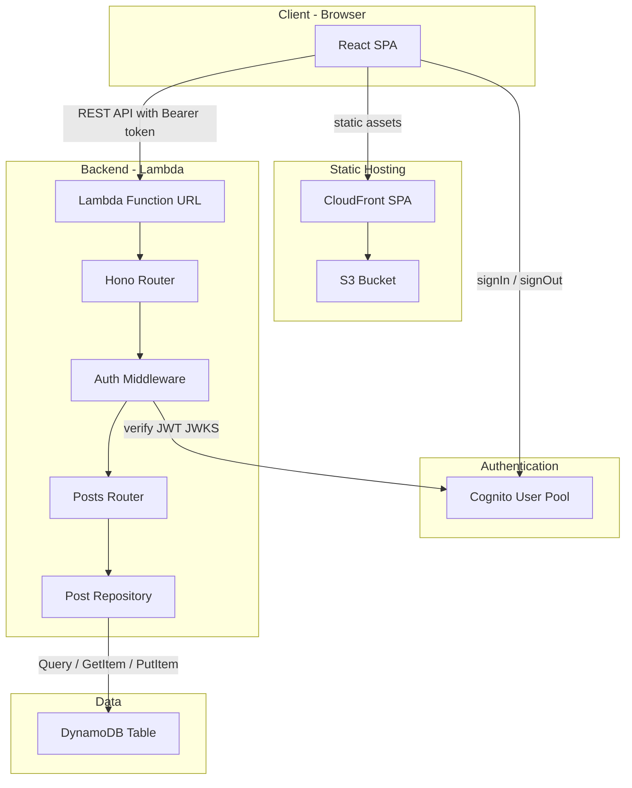
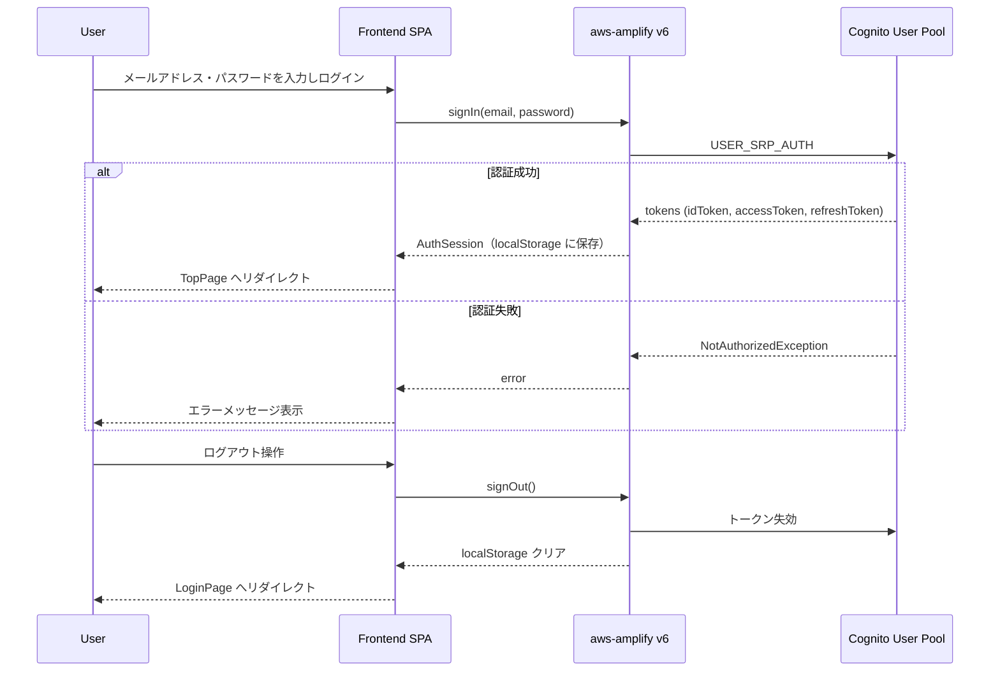
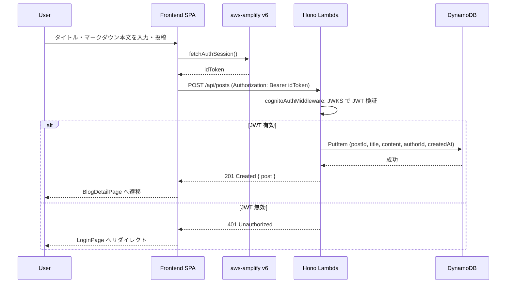

# Design Document: fullstack-tech-blog

## Overview

フルスタックサーバーレスブログシステムを構築する。フロントエンドは React 19 SPA として S3+CloudFront で配信され、バックエンドは Hono on AWS Lambda として Lambda Function URL 経由で公開される。認証は Amazon Cognito User Pool によるメール/パスワード方式で行い、フロントエンドは aws-amplify v6 でトークンを管理する。

**Purpose**: ブログ閲覧（未認証可）と記事投稿（認証必須）を提供するフルスタックサーバーレスブログアプリ。Spec駆動開発の学習リファレンス実装を兼ねる。  
**Users**: 一般閲覧者（未認証）・記事投稿者（認証済みユーザー）。  
**Impact**: 既存スケルトン（pkgs/frontend・backend・cdk）を本格的なブログアプリとして全面拡充する。

### Goals
- Cognito メール/パスワード認証の完全実装
- React SPA + Hono Lambda API のフルスタック構成確立
- マークダウンリアルタイムプレビュー付き投稿機能の実装
- TDD（Vitest + Playwright）による品質担保

### Non-Goals
- ブログ記事の編集・削除
- コメント機能、タグ・カテゴリ管理、ソーシャルログイン
- 管理者機能、ユーザープロファイル管理
- CI/CD パイプライン、マルチ環境 CDK 管理
- カスタムドメイン、画像/ファイルアップロード

---

## Boundary Commitments

### This Spec Owns
- **フロントエンド SPA**: 全4画面（ログイン・トップ・詳細・投稿）の UI・状態管理・ルーティング
- **バックエンド API**: `/api/posts` REST エンドポイント（一覧・詳細・作成）と Cognito JWT 検証ミドルウェア
- **共有パッケージ (`shared`)**: Post 型定義・zod バリデーションスキーマ
- **CDK インフラ**: DynamoDB・Lambda・Cognito・S3・CloudFront の定義と IAM 最小権限設定

### Out of Boundary
- Cognito ユーザー作成・招待（コンソールまたは CLI で行う）
- ブログ記事の編集・削除・公開/非公開切り替え
- CI/CD パイプライン・デプロイ自動化
- カスタムドメイン設定・WAF 設定
- 画像・ファイルアップロード機能

### Allowed Dependencies
- AWS サービス: DynamoDB TableV2、Lambda Function URL、Cognito UserPool、S3、CloudFront（CDK L2 経由）
- フロントエンド追加: `aws-amplify` v6、`react-markdown` v9、`remark-gfm`、`rehype-highlight`、`react-router-dom` v7、`tailwindcss`、`shadcn/ui`
- バックエンド追加: `aws-jwt-verify`、`@aws-sdk/lib-dynamodb`、`uuid`
- 共有追加: `zod`

### Revalidation Triggers
- `shared/src/types/post.ts` のスキーマ変更 → API レスポンス型・フロントエンド型の同期確認
- Cognito UserPool 認証フロー変更（MFA 追加等）→ `useAuth` フックと CDK 構成の再確認
- Lambda Function URL の CORS 設定変更 → フロントエンドの API クライアント設定確認
- DynamoDB GSI 変更 → `PostRepository.listPosts` クエリの再確認

---

## Architecture

### Architecture Pattern & Boundary Map

シングルクラウドのサーバーレス 3層アーキテクチャ。依存方向: `shared (Types/Schemas)` → `backend (Repository → Service → Router)` / `frontend (hooks → pages → components)`。バックエンドは shared にのみ依存し、フロントエンドは共有型を通じてバックエンドと契約する。



### Technology Stack

| Layer | Choice / Version | Role in Feature |
|-------|-----------------|-----------------|
| Frontend UI | React 19 + Vite 8 + TypeScript 6 | SPA フレームワーク |
| Frontend Routing | react-router-dom v7 | クライアントサイドルーティング |
| Frontend Styling | Tailwind CSS + shadcn/ui | UI コンポーネント・スタイリング |
| Frontend Auth | aws-amplify v6 (モジュラー) | Cognito 認証・トークン管理 |
| Markdown | react-markdown v9 + remark-gfm + rehype-highlight | Markdown レンダリング・コードハイライト |
| Backend Runtime | Hono 4 on Lambda (Node.js 20.x) | REST API サーバー |
| Backend Auth | aws-jwt-verify ^3 | Cognito JWT 検証（JWKS キャッシュ付き） |
| Backend Data | @aws-sdk/lib-dynamodb | DynamoDB アクセス（Document Client） |
| Shared | zod | 入力バリデーションスキーマ |
| Infra | AWS CDK v2 (TypeScript) | IaC 全 AWS リソース定義 |
| Database | DynamoDB TableV2 (on-demand) | ブログ記事永続化 |
| Storage | S3 + CloudFront (OAC) | SPA 静的アセット配信 |
| Auth Service | Cognito User Pool | ユーザー認証・JWT 発行 |

> ローカル開発: バックエンドは `@hono/node-server` + `tsx watch`（既存設定）で起動し、Lambda デプロイ時のみ `hono/aws-lambda` アダプタに切り替える。DynamoDB は開発用 AWS アカウントのテーブルを利用する。

---

## File Structure Plan

### Directory Structure

```
pkgs/
├── shared/
│   ├── src/
│   │   ├── types/
│   │   │   ├── post.ts          # Post, PostSummary, CreatePostInput 型定義
│   │   │   └── auth.ts          # AuthUser 型定義
│   │   ├── schemas/
│   │   │   └── post.ts          # zod createPostSchema, postIdSchema
│   │   └── index.ts             # 全エクスポート
│   └── package.json             # zod 追加
│
├── backend/
│   ├── src/
│   │   ├── index.ts             # Hono app 構築・Lambda handler エクスポート / Node server 起動
│   │   ├── middleware/
│   │   │   └── auth.ts          # cognitoAuthMiddleware (aws-jwt-verify)
│   │   ├── routes/
│   │   │   └── posts.ts         # GET /api/posts, GET /api/posts/:id, POST /api/posts
│   │   ├── repositories/
│   │   │   └── post.repository.ts  # DynamoDB CRUD（listPosts・getPost・createPost）
│   │   └── types.ts             # Hono Env 型（Variables.jwtPayload）
│   └── package.json             # aws-jwt-verify, @aws-sdk/lib-dynamodb, uuid 追加
│
├── frontend/
│   ├── src/
│   │   ├── main.tsx             # Amplify.configure → ReactDOM.render
│   │   ├── App.tsx              # react-router-dom ルート定義
│   │   ├── components/
│   │   │   ├── ui/              # shadcn/ui 自動生成コンポーネント（Button, Form, Input 等）
│   │   │   ├── auth/
│   │   │   │   └── ProtectedRoute.tsx   # 未認証時 /login へリダイレクト
│   │   │   ├── blog/
│   │   │   │   ├── BlogPostCard.tsx      # 一覧カードコンポーネント
│   │   │   │   └── MarkdownEditor.tsx    # スプリットペイン マークダウンエディタ
│   │   │   └── layout/
│   │   │       └── NavBar.tsx            # ログアウトボタン付きナビゲーション
│   │   ├── pages/
│   │   │   ├── LoginPage.tsx
│   │   │   ├── TopPage.tsx
│   │   │   ├── BlogDetailPage.tsx
│   │   │   └── BlogCreatePage.tsx
│   │   ├── hooks/
│   │   │   └── useAuth.ts        # aws-amplify v6 ラッパー（user, signIn, signOut, isLoading）
│   │   └── lib/
│   │       ├── api.ts            # 型付き API クライアント（JWT 自動付与）
│   │       └── amplify.ts        # Amplify.configure 設定
│   └── package.json              # aws-amplify, react-markdown 等追加
│
└── cdk/
    ├── bin/
    │   └── cdk.ts               # CDK App エントリポイント
    └── lib/
        └── blog-stack.ts        # 既存 cdk-stack.ts を置換：全 AWS リソース定義
```

### Modified Files
- `pkgs/cdk/lib/cdk-stack.ts` → `blog-stack.ts` に置換（空スタックから本番インフラへ）
- `pkgs/backend/src/index.ts` → Lambda アダプタ + ルーター構成へ全面更新
- `pkgs/frontend/src/main.tsx` → Amplify.configure 追加
- `pkgs/frontend/src/App.tsx` → react-router-dom ルート定義へ全面更新

---

## System Flows

### 認証フロー（ログイン・ログアウト）



### ブログ投稿フロー



---

## Requirements Traceability

| Requirement | Summary | Components | Interfaces | Flows |
|-------------|---------|------------|------------|-------|
| 1.1 | ログイン成功→トップ画面遷移 | LoginPage, useAuth, ProtectedRoute | signIn() | 認証フロー |
| 1.2 | 認証失敗→エラー表示 | LoginPage, useAuth | signIn() error | 認証フロー |
| 1.3 | 未入力バリデーション | LoginPage | zod loginSchema | — |
| 1.4 | 未認証→ログイン画面リダイレクト | ProtectedRoute | useAuth.user | — |
| 1.5 | ページ再読み込み後セッション継続 | useAuth, amplify.ts | fetchAuthSession() | — |
| 2.1 | 認証済み時ログアウトUI表示 | NavBar | useAuth.user | — |
| 2.2 | ログアウト→ログイン画面遷移 | NavBar, useAuth | signOut() | 認証フロー |
| 2.3 | ログアウト後バック操作でリダイレクト | ProtectedRoute | useAuth.user | — |
| 3.1 | トップ画面に記事概要一覧表示 | TopPage, BlogPostCard | GET /api/posts | — |
| 3.2 | 新着順表示 | PostRepository.listPosts | GSI byCreatedAt DESC | — |
| 3.3 | 記事クリック→詳細画面遷移 | BlogPostCard | react-router-dom Link | — |
| 3.4 | 記事0件→空状態メッセージ | TopPage | — | — |
| 3.5 | 未認証でも一覧閲覧可 | PostsRouter (GET routes は認証不要) | GET /api/posts | — |
| 4.1 | 詳細画面にマークダウンレンダリング | BlogDetailPage | GET /api/posts/:id, react-markdown | — |
| 4.2 | 存在しない記事→エラー表示 | BlogDetailPage | 404 response | — |
| 4.3 | トップへ戻るナビゲーション | BlogDetailPage | react-router-dom Link | — |
| 4.4 | 未認証でも詳細閲覧可 | PostsRouter (GET routes は認証不要) | GET /api/posts/:id | — |
| 5.1 | 投稿画面でエディタ+プレビュー提供 | BlogCreatePage, MarkdownEditor | — | — |
| 5.2 | リアルタイムプレビュー | MarkdownEditor | react-markdown | — |
| 5.3 | 投稿成功→詳細or一覧遷移 | BlogCreatePage | POST /api/posts | 投稿フロー |
| 5.4 | 未入力バリデーション | BlogCreatePage | zod createPostSchema | — |
| 5.5 | 投稿画面は認証保護 | ProtectedRoute | useAuth.user | — |
| 6.1 | レスポンシブデザイン | 全ページ | Tailwind CSS responsive breakpoints | — |
| 6.2 | API 3秒以内レスポンス | PostRepository, DynamoDB | on-demand billing, GSI | — |
| 6.3 | 認証情報保護 | cognitoAuthMiddleware, aws-amplify | HTTPS, JWT 検証 | — |
| 6.4 | TypeScript 型安全 | shared/types, zod schemas | Post, CreatePostInput | — |

---

## Components and Interfaces

### Summary Table

| Component | Domain/Layer | Intent | Req Coverage | Key Dependencies |
|-----------|-------------|--------|--------------|-----------------|
| useAuth | Frontend / Hook | Cognito 認証状態管理 | 1.1–1.5, 2.1–2.3 | aws-amplify v6 (P0) |
| ProtectedRoute | Frontend / Auth | 未認証ルート保護 | 1.4, 2.3, 5.5 | useAuth (P0) |
| MarkdownEditor | Frontend / Blog | スプリットペインエディタ | 5.1, 5.2 | react-markdown (P0) |
| api.ts | Frontend / Client | 型付きAPIクライアント | 3.1, 4.1, 5.3 | aws-amplify fetchAuthSession (P0) |
| LoginPage | Frontend / Page | ログインフォーム | 1.1–1.3 | useAuth, shadcn/ui Form |
| TopPage | Frontend / Page | 記事一覧 | 3.1–3.5 | api.ts, BlogPostCard |
| BlogDetailPage | Frontend / Page | 記事詳細 | 4.1–4.4 | api.ts, react-markdown |
| BlogCreatePage | Frontend / Page | 記事投稿 | 5.1–5.5 | MarkdownEditor, api.ts |
| NavBar | Frontend / Layout | ナビゲーション・ログアウト | 2.1, 2.2 | useAuth |
| BlogPostCard | Frontend / Blog | 一覧カード表示 | 3.1, 3.3 | react-router-dom |
| cognitoAuthMiddleware | Backend / Auth | JWT 検証 Hono ミドルウェア | 1.4, 5.5, 6.3 | aws-jwt-verify (P0) |
| PostsRouter | Backend / API | REST エンドポイント定義 | 3.1–3.5, 4.1–4.4, 5.3 | cognitoAuthMiddleware, PostRepository |
| PostRepository | Backend / Data | DynamoDB アクセス層 | 3.2, 4.2, 5.3, 6.2 | @aws-sdk/lib-dynamodb (P0) |
| PostTypes / PostSchema | Shared | 型・バリデーション定義 | 1.3, 5.4, 6.4 | zod (P0) |
| BlogStack | Infra / CDK | 全 AWS リソース定義 | 6.1–6.4 | aws-cdk-lib (P0) |

---

### Frontend / Authentication

#### useAuth

| Field | Detail |
|-------|--------|
| Intent | Cognito 認証状態の React フック（signIn・signOut・セッション復元） |
| Requirements | 1.1, 1.2, 1.3, 1.5, 2.1, 2.2, 2.3 |

**Responsibilities & Constraints**
- `signIn` / `signOut` の呼び出しと結果の状態管理
- アプリ起動時に `fetchAuthSession` でセッション復元（1.5）
- `isLoading` フラグで認証確認中のチラツキを防止

**Dependencies**
- Outbound: aws-amplify/auth — signIn, signOut, fetchAuthSession, getCurrentUser (P0)

**Contracts**: Service [x] / API [ ] / Event [ ] / Batch [ ] / State [x]

```typescript
interface AuthUser {
  sub: string;
  email: string;
}

interface UseAuthReturn {
  user: AuthUser | null;
  isLoading: boolean;
  signIn(email: string, password: string): Promise<void>;
  signOut(): Promise<void>;
}
```

**State Management**
- State: `{ user: AuthUser | null, isLoading: boolean }`
- Persistence: aws-amplify が localStorage にトークンを自動保存
- Concurrency: `isLoading` で多重 signIn 呼び出し防止

**Implementation Notes**
- `NotAuthorizedException` は `signIn` が throw するので `LoginPage` 側で catch してエラー表示
- セッション復元は `main.tsx` ではなく useAuth の `useEffect` で行い、全ページでの認証状態一貫性を保つ

---

#### ProtectedRoute

| Field | Detail |
|-------|--------|
| Intent | 未認証ユーザーを `/login` へリダイレクトするルートガード |
| Requirements | 1.4, 2.3, 5.5 |

**Implementation Notes**
- `useAuth.isLoading` が true の間は null/スピナーを返し、認証確認完了後にルーティング判断する
- react-router-dom の `<Navigate replace>` でブラウザ履歴を汚染しない

---

### Frontend / Blog

#### MarkdownEditor

| Field | Detail |
|-------|--------|
| Intent | 左ペイン：textarea、右ペイン：react-markdown リアルタイムプレビュー（スプリットペイン） |
| Requirements | 5.1, 5.2 |

**Dependencies**
- Outbound: react-markdown + remark-gfm + rehype-highlight (P0)

**Contracts**: Service [ ] / API [ ] / Event [ ] / Batch [ ] / State [x]

```typescript
interface MarkdownEditorProps {
  value: string;
  onChange: (value: string) => void;
  placeholder?: string;
}
```

**Implementation Notes**
- スプリットペインは Tailwind CSS の `grid grid-cols-2` で実装（外部ライブラリ不要）
- `react-markdown` は `remarkPlugins={[remarkGfm]}` で GFM（テーブル・タスクリスト等）を有効化
- `rehype-highlight` でコードブロックのシンタックスハイライトを提供

---

### Frontend / Client

#### api.ts

| Field | Detail |
|-------|--------|
| Intent | バックエンド REST API への型付きクライアント（JWT Bearer 自動付与） |
| Requirements | 3.1, 3.2, 4.1, 5.3 |

**Dependencies**
- Outbound: aws-amplify/auth fetchAuthSession — JWT 取得 (P0)
- Outbound: Lambda Function URL — HTTP リクエスト送先 (P0)

**Contracts**: Service [x] / API [x]

```typescript
interface ApiClient {
  getPosts(cursor?: string): Promise<{ posts: PostSummary[]; nextCursor?: string }>;
  getPost(postId: string): Promise<Post>;
  createPost(input: CreatePostInput): Promise<Post>;
}
```

**Implementation Notes**
- `VITE_API_BASE_URL` 環境変数でエンドポイントを切り替え（ローカル: `http://localhost:3000`、本番: Lambda Function URL）
- 認証不要エンドポイント（GET）は Authorization ヘッダーを省略する
- 401 レスポンス時は自動的に `/login` にリダイレクト

---

### Backend / Auth

#### cognitoAuthMiddleware

| Field | Detail |
|-------|--------|
| Intent | Authorization ヘッダーの Cognito JWT を検証する Hono ミドルウェア |
| Requirements | 1.4, 5.5, 6.3 |

**Dependencies**
- Outbound: aws-jwt-verify CognitoJwtVerifier — JWKS 取得・署名検証 (P0)
- Outbound: Cognito JWKS エンドポイント (External, P0)

**Contracts**: Service [x]

```typescript
// types.ts
type HonoEnv = {
  Variables: {
    jwtPayload: { sub: string; email: string };
  };
};

// CognitoJwtVerifier はモジュールレベルで1回だけ生成（Lambda コールドスタート最適化）
const verifier = CognitoJwtVerifier.create({
  userPoolId: process.env.COGNITO_USER_POOL_ID!,
  tokenUse: "id",
  clientId: process.env.COGNITO_CLIENT_ID!,
});
```

**Implementation Notes**
- `tokenUse: "id"` を指定（フロントエンドは idToken を送信、email クレームが含まれる）
- Verifier インスタンスはモジュールスコープで生成し JWKS キャッシュを活用する
- 検証失敗時は `c.json({ error: "Unauthorized" }, 401)` を返す

---

### Backend / API

#### PostsRouter

| Field | Detail |
|-------|--------|
| Intent | ブログ記事 REST API の Hono ルーター定義 |
| Requirements | 3.1–3.5, 4.1–4.4, 5.3, 5.5 |

**Dependencies**
- Inbound: cognitoAuthMiddleware — POST 保護 (P0)
- Outbound: PostRepository — データアクセス (P0)

**Contracts**: Service [ ] / API [x]

##### API Contract

| Method | Endpoint | Request | Response | Errors |
|--------|----------|---------|----------|--------|
| GET | /api/posts | query: `cursor?` | `{ posts: PostSummary[], nextCursor?: string }` | 500 |
| GET | /api/posts/:id | path: `postId` | `Post` | 404, 500 |
| POST | /api/posts | body: `CreatePostInput`, Header: `Authorization: Bearer {idToken}` | `Post` (201) | 400, 401, 500 |

---

### Backend / Data

#### PostRepository

| Field | Detail |
|-------|--------|
| Intent | DynamoDB Document Client を用いたブログ記事 CRUD |
| Requirements | 3.2, 4.2, 5.3, 6.2 |

**Dependencies**
- External: @aws-sdk/lib-dynamodb DynamoDBDocumentClient (P0)
- External: DynamoDB Table + GSI byCreatedAt (P0)

**Contracts**: Service [x]

```typescript
interface PostRepository {
  listPosts(cursor?: string): Promise<{ posts: PostSummary[]; nextCursor?: string }>;
  getPost(postId: string): Promise<Post | null>;
  createPost(input: CreatePostInput & { authorId: string; authorEmail: string }): Promise<Post>;
}
```

**Implementation Notes**
- `listPosts`: GSI `byCreatedAt`（PK=`"POST"`, SK=ISO8601 createdAt）を `ScanIndexForward: false`・`Limit: 20` でクエリ。ページネーションは `ExclusiveStartKey` / `LastEvaluatedKey` で実装
- `getPost`: PK=`POST#{postId}`・SK=`#METADATA` で GetItem
- `createPost`: `uuid()` で postId 生成、PutItem に `ConditionExpression: "attribute_not_exists(pk)"` を付与して重複防止
- excerpt は `listPosts` 側でコンテンツ先頭 200 文字を切り出してレスポンスに含める

---

### Shared

#### PostTypes / PostSchema

```typescript
// shared/src/types/post.ts
interface Post {
  postId: string;
  title: string;
  content: string;       // raw markdown
  authorId: string;      // Cognito sub
  authorEmail: string;
  createdAt: string;     // ISO 8601
}

type PostSummary = Pick<Post, "postId" | "title" | "authorEmail" | "createdAt"> & {
  excerpt: string;       // content の先頭 200 文字
};

interface CreatePostInput {
  title: string;
  content: string;
}
```

```typescript
// shared/src/schemas/post.ts
const createPostSchema = z.object({
  title: z.string().min(1, "タイトルは必須です").max(200),
  content: z.string().min(1, "本文は必須です").max(50000),
});

const postIdSchema = z.string().uuid();
```

---

### Infrastructure / CDK

#### BlogStack

| Field | Detail |
|-------|--------|
| Intent | 全 AWS リソース（Cognito・DynamoDB・Lambda・S3・CloudFront）の CDK 定義 |
| Requirements | 6.1–6.4 |

**Key Resources:**
- `cognito.UserPool`: `signInAliases: { email: true }`, `selfSignUpEnabled: true`
- `cognito.UserPoolClient`: `authFlows: { userPassword: true, userSrp: true }`, `generateSecret: false`
- `dynamodb.TableV2`: PK=`pk`, SK=`sk`, GSI `byCreatedAt`（PK=`gsi1pk`, SK=`gsi1sk`）, on-demand billing
- `lambda.Function`: Node.js 20.x, `TABLE_NAME`・`COGNITO_USER_POOL_ID`・`COGNITO_CLIENT_ID` を環境変数で注入
- `lambda.FunctionUrl`: `authType: NONE`（CORS は Hono で制御）
- S3 + CloudFront (OAC) で SPA 配信
- `table.grantReadWriteData(fn)` で最小権限 IAM

---

## Data Models

### Domain Model

```
BlogPost (Aggregate Root)
  - postId: UUID（システム生成）
  - title: string (1–200文字)
  - content: string (1–50000文字、raw markdown)
  - authorId: string (Cognito sub, 不変)
  - authorEmail: string
  - createdAt: ISO 8601 timestamp (不変)

Invariant: postId は一意。createdAt・authorId は作成後不変。
```

### Logical Data Model (DynamoDB)

**テーブル: BlogTable（シングルテーブル）**

| 属性 | 型 | ロール | 値例 |
|------|-----|--------|------|
| pk | String | PK | `POST#01J...` |
| sk | String | SK | `#METADATA` |
| gsi1pk | String | GSI PK | `"POST"` |
| gsi1sk | String | GSI SK | `"2026-06-04T12:00:00.000Z"` |
| postId | String | ビジネスID | `"01J..."` |
| title | String | 記事タイトル | `"Hello World"` |
| content | String | マークダウン本文 | `"# Hello\n..."` |
| authorId | String | Cognito sub | `"abc123..."` |
| authorEmail | String | 投稿者メール | `"user@example.com"` |
| createdAt | String | 作成日時 ISO | `"2026-06-04T..."` |

**GSI: byCreatedAt**
- PK: `gsi1pk` → `"POST"` (固定値、全記事をグルーピング)
- SK: `gsi1sk` → ISO 8601 createdAt
- Projection: ALL
- クエリ: `ScanIndexForward: false` で新着順、`Limit: 20` でページネーション

---

## Error Handling

### Error Strategy

- **フロントエンド**: zod バリデーションエラーはフィールドレベルで表示（shadcn/ui Form の `formState.errors`）
- **API 4xx**: ユーザー向けメッセージを含む JSON `{ error: string }` を返す
- **API 5xx**: 詳細はサーバーログに留め、フロントエンドには汎用メッセージを返す

### Error Categories

**User Errors (4xx)**
- 400 バリデーション失敗: `{ error: "Validation failed", details: zodError.flatten() }`
- 401 未認証: `{ error: "Unauthorized" }`
- 404 記事未存在: `{ error: "Post not found" }`

**System Errors (5xx)**
- 500: `{ error: "Internal server error" }`（Lambda CloudWatch Logs に詳細記録）

**Frontend Error UX**
- 401 → `/login` へリダイレクト（api.ts でインターセプト）
- 404 → インラインエラーメッセージ + トップへ戻るリンク（4.2）
- ネットワークエラー → トースト通知（shadcn/ui Toaster）

---

## Testing Strategy

### Unit Tests (Vitest)

1. **`shared/schemas/post.ts`**: `createPostSchema` の境界値（空文字・最大長・最大超過）
2. **`backend/middleware/auth.ts`**: 有効JWT・無効JWT・Authorizationヘッダー欠如の各ケース（aws-jwt-verify をモック）
3. **`backend/repositories/post.repository.ts`**: listPosts（ページネーション込み）・getPost（存在・不存在）・createPost の DynamoDB モック
4. **`backend/routes/posts.ts`**: 各エンドポイントの正常系・エラー系（Hono テストクライアントを使用）
5. **`frontend/hooks/useAuth.ts`**: signIn 成功・失敗・signOut・初期セッション復元

### Integration Tests (Vitest)

1. **認証フロー**: cognitoAuthMiddleware → PostsRouter の POST エンドポイント（JWT あり/なし）
2. **記事一覧取得**: PostsRouter GET → PostRepository → DynamoDB Local（またはモック）
3. **記事投稿**: zod バリデーション → PostRepository.createPost の ID 一意性

### E2E Tests (Playwright)

1. **ログイン→投稿→確認**: ログイン画面からログインし、記事を投稿してブログ詳細画面で内容確認
2. **未認証ガード**: 未ログイン状態で `/create` にアクセス → ログイン画面へリダイレクト確認
3. **マークダウンプレビュー**: 投稿画面でマークダウン入力後、プレビューエリアにレンダリング内容が反映されることを確認
4. **ログアウト→セッション切断**: ログアウト後にブラウザバックで投稿画面に戻れないことを確認

---

## Security Considerations

- **JWT 検証**: aws-jwt-verify が JWKS キャッシュ付きで Cognito 公開鍵を検証。`hono/jwt` は Cognito 非対応のため使用しない
- **CORS**: Hono cors ミドルウェアで `origin` を具体的ドメイン（Vite dev: `http://localhost:5173`、本番: CloudFront URL）に限定。`credentials: false`（Cookie 未使用）
- **トークン保管**: aws-amplify のデフォルト（localStorage）を採用。本プロジェクトは学習用途のため許容する
- **DynamoDB アクセス**: CDK `table.grantReadWriteData(fn)` で Lambda に最小権限 IAM を付与
- **Lambda Function URL**: `authType: NONE` で公開（CORS + JWT で保護）。将来的に CloudFront OAC 追加で保護強化可能

## Performance & Scalability

- **DynamoDB on-demand**: ブログ程度のアクセス量では課金・スケーリング共に最適
- **GSI クエリ**: `Limit: 20` + カーソルページネーションで大量データ時も一定パフォーマンスを維持
- **JWKS キャッシュ**: CognitoJwtVerifier のモジュールスコープ初期化でコールドスタート以外は JWKS フェッチを回避
- **SPA CDN**: CloudFront キャッシュで静的アセットのレイテンシを最小化
- **目標**: API レスポンス通常時 3秒以内（6.2）は DynamoDB on-demand + Lambda のウォームスタートで達成可能
